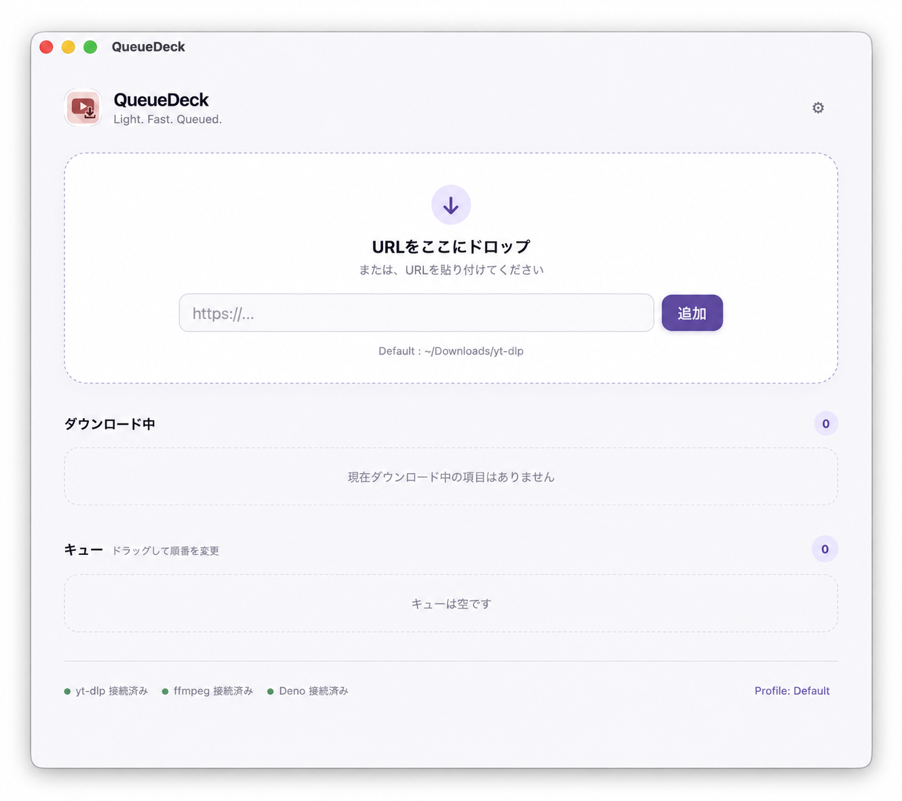
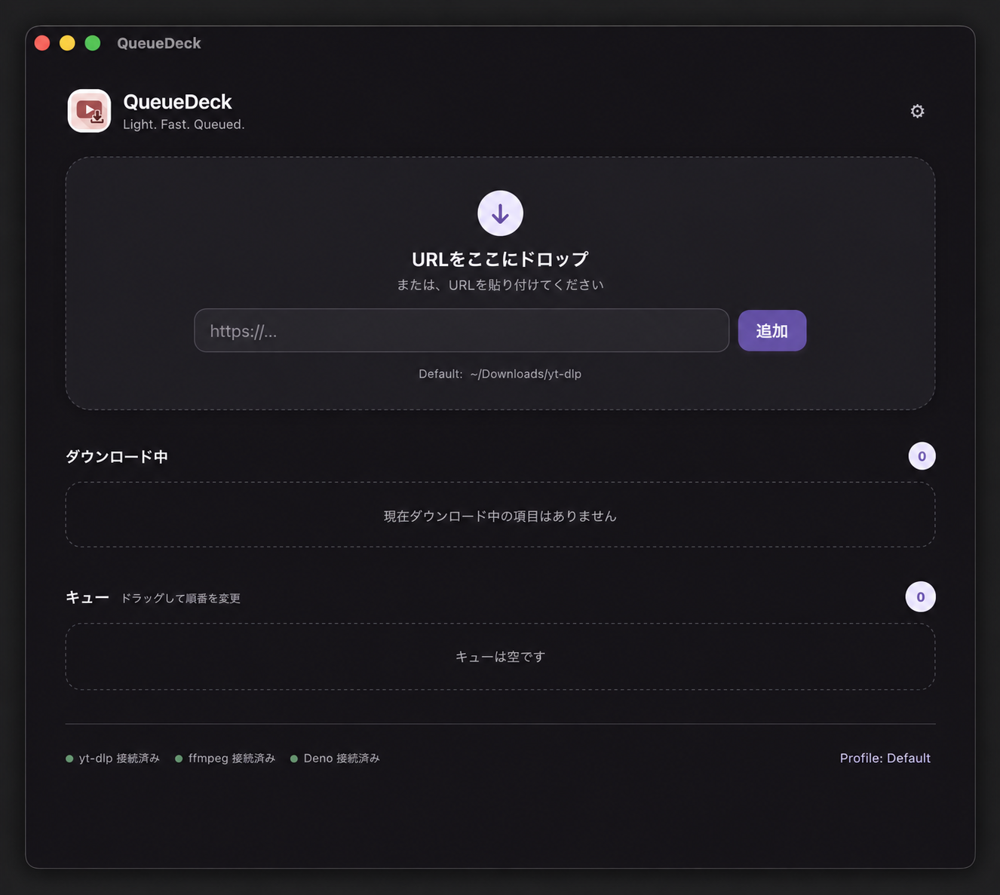
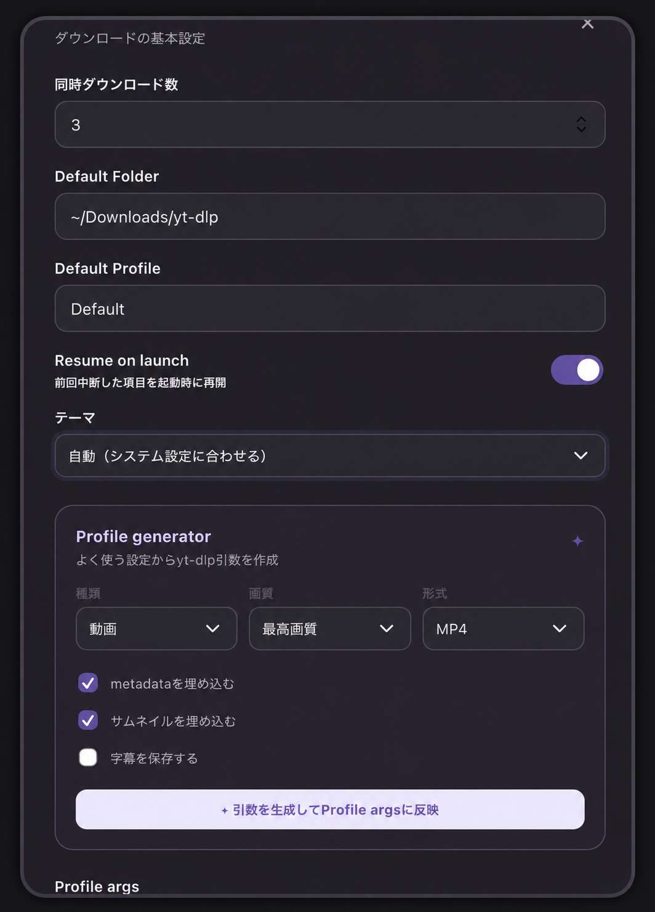

# QueueDeck

`yt-dlp`を使った動画・音声ダウンロードを、URLの貼り付けとキューで管理するデスクトップアプリです。

## 画面

### メイン画面（Light）



### メイン画面（Dark）



### 設定とProfile generator



## Codexを使ってインストールする場合

Codexを使っている場合は、このリポジトリを開いた状態で「QueueDeckをインストールして」と依頼しても構いません。必要な手順の案内や実行をCodexに任せられます。`yt-dlp`・`ffmpeg`・Denoの追加インストールや権限の確認が必要な場合は、画面の指示に従ってください。

## インストール方法

### Windows版

#### 1. アプリを入れる

GitHubのReleasesから、Windows用の`.msi`またはセットアップ用`.exe`をダウンロードしてインストールしてください。

#### 2. 必要なものを入れる

以下の3つが必要です。

- [yt-dlp](https://github.com/yt-dlp/yt-dlp/releases/latest)：動画・音声を取得する本体
- [ffmpeg](https://ffmpeg.org/download.html)：動画と音声の結合・変換
- [Deno](https://docs.deno.com/runtime/getting_started/installation/)（2.3.0以上）：YouTubeの取得処理に使用するJavaScriptランタイム

yt-dlpは、公式Releaseにある`yt-dlp.exe`を使用してください。ダウンロードしたファイルを、PATHの通ったフォルダに置きます。公式の単体版を使う場合、PythonやNode.jsは必要ありません。

DenoはPowerShellで次のコマンドを実行するとインストールできます。

```powershell
irm https://deno.land/install.ps1 | iex
```

または、Windowsのパッケージマネージャーを使う場合は次のコマンドでもインストールできます。

```powershell
winget install DenoLand.Deno
```

ffmpegは公式サイトからWindows向けのビルドを入手し、`ffmpeg.exe`をPATHの通ったフォルダに置いてください。

#### 3. 動作確認

新しくコマンドプロンプトまたはPowerShellを開き、次を実行します。

```powershell
yt-dlp --version
ffmpeg -version
deno --version
```

3つともバージョンが表示されれば準備完了です。確認後にアプリを起動してください。

### Mac版

#### 1. アプリを入れる

GitHubのReleasesから、自分のMacに合う`.dmg`をダウンロードしてください。

- Apple Silicon（M1/M2/M3/M4など）：`aarch64`の`.dmg`
- Intel Mac：`x86_64`の`.dmg`

#### 2. 必要なものを入れる

以下の3つが必要です。

- [yt-dlp](https://github.com/yt-dlp/yt-dlp/releases/latest)：動画・音声を取得する本体
- [ffmpeg](https://ffmpeg.org/download.html)：動画と音声の結合・変換
- [Deno](https://docs.deno.com/runtime/getting_started/installation/)（2.3.0以上）：YouTubeの取得処理に使用するJavaScriptランタイム

Homebrewを使える場合は、ffmpegとDenoを次のコマンドでインストールできます。

```bash
brew install deno ffmpeg
```

yt-dlpは公式ReleaseからMac用の実行ファイルをダウンロードし、ターミナルから実行できる場所に置いてください。ファイル名を`yt-dlp`にして実行権限を付けます。公式の単体版を使う場合、PythonやNode.jsは必要ありません。

```bash
chmod +x yt-dlp
```

#### 3. 動作確認

ターミナルを新しく開き、次を実行します。

```bash
yt-dlp --version
ffmpeg -version
deno --version
```

3つともバージョンが表示されれば準備完了です。確認後にアプリを起動してください。

### アプリがツールを見つけられない場合

アプリ画面の下部にある`未検出`をクリックすると、yt-dlp・ffmpeg・Denoの状態を確認できます。インストール後に`再チェック`を押してください。

PATHを追加した直後は、アプリを一度終了して起動し直す必要があります。

## 使い方

1. アプリを起動します。
2. URLを入力して「追加」を押すか、URLを画面へドロップします。
3. キューに追加された項目は、順番をドラッグして変更できます。
4. ダウンロード中の項目は停止できます。停止した項目は再開できます。
5. 設定から保存先、同時ダウンロード数、Profile argsを変更できます。

エラーが発生した項目に「ログ」が表示された場合は、保存されたエラー詳細を確認・コピーできます。

設定画面のProfile generatorでは、画質・形式・メタデータ・サムネイル・字幕の設定からyt-dlpの引数を作成できます。

## 保存されるデータ

アプリのデータフォルダに以下を保存します。

- `settings.json`：保存先、同時ダウンロード数、Resume設定、Profile args
- `state.json`：キュー、進捗、エラー履歴
- `download-archive.txt`：ダウンロード済み項目の記録

エラーの詳細は`state.json`に保存されます。Resume on launchが有効な場合、前回中断した項目を次回起動時に再開します。

## 注意

- `yt-dlp`、`ffmpeg`、Denoのインストール・更新はアプリから行いません。
- YouTubeなどのサービスを利用する場合は、各サービスの利用規約と著作権を確認してください。
- プレイリスト専用UIや細かなformat選択UIにはまだ対応していません。
- macOS版はアドホック署名です。初回起動時に警告が表示された場合は、右クリックの「開く」または「システム設定 > プライバシーとセキュリティ」から許可してください。
- Windows版は未署名の場合、SmartScreenの確認が表示されることがあります。
